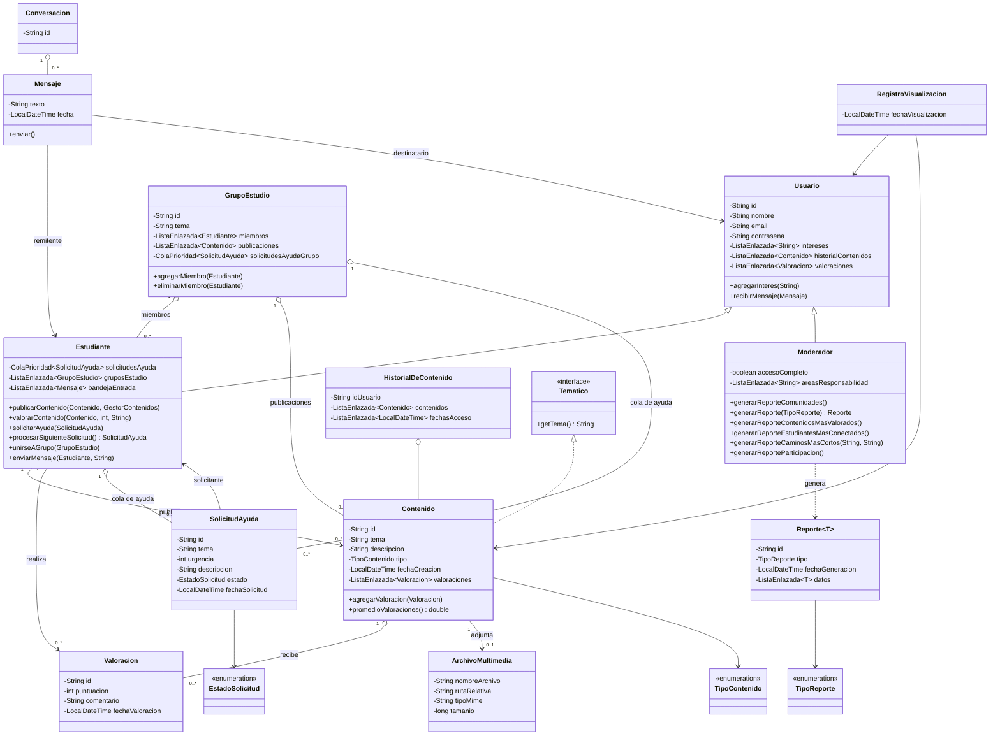
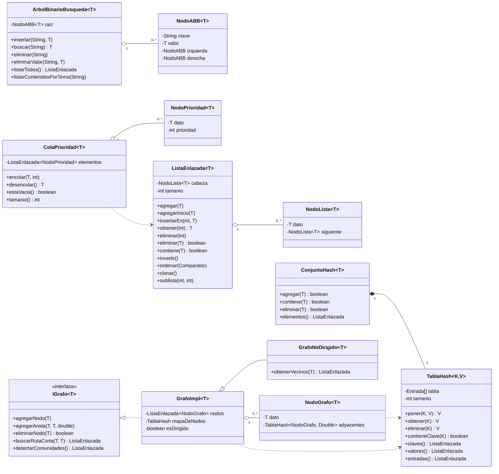
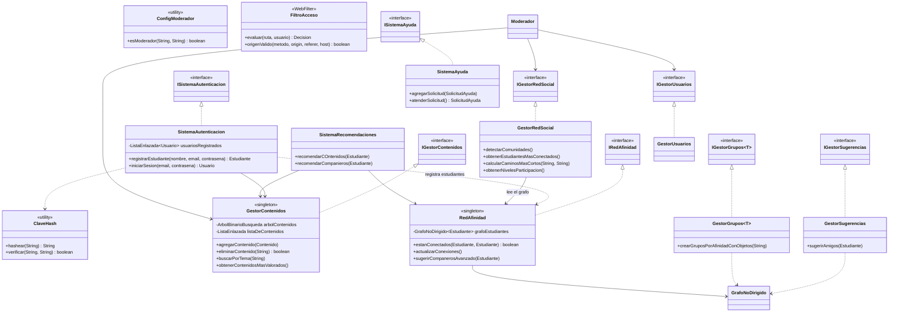

# Diagrama de clases

Los diagramas están escritos en [Mermaid](https://mermaid.js.org/): GitHub los muestra como imagen
al abrir este archivo. Para exportarlos a PNG/PDF (por ejemplo para la entrega) se puede pegar cada
bloque en <https://mermaid.live>.

Se dividen en tres vistas para que sean legibles:

1. [Modelo de dominio](#1-modelo-de-dominio)
2. [Estructuras de datos propias](#2-estructuras-de-datos-propias)
3. [Servicios](#3-servicios)

---

## 1. Modelo de dominio

---

## 2. Estructuras de datos propias

El proyecto no usa colecciones de `java.util`: todas las estructuras están implementadas en
`models/structures`.

| Requisito del enunciado | Estructura | Dónde se usa |
|---|---|---|
| Grafo no dirigido de afinidad | `GrafoNoDirigido` | `RedAfinidad`, `GestorRedSocial`, `GestorGrupos` |
| Árbol binario de búsqueda de contenidos | `ArbolBinarioBusqueda` | `GestorContenidos` (indexa por tema) |
| Cola de prioridad de solicitudes de ayuda | `ColaPrioridad` | `Estudiante`, `GrupoEstudio`, `SistemaAyuda` |
| Listas enlazadas (historial, valoraciones, grupos) | `ListaEnlazada` | Todo el modelo |
| (apoyo) tabla hash y conjunto | `TablaHash`, `ConjuntoHash` | Grafo, Dijkstra, recorridos, estadísticas |

---

## 3. Servicios

### Capa web (servlets)

Los servlets del paquete `drivers` se registran con `@WebServlet` y delegan en los servicios de arriba.
Los principales:

| Área | Servlets |
|---|---|
| Acceso | `LoginServlet`, `RegistroServlet`, `CerrarSesionServlet` |
| Contenidos | `CrearPublicacionServlet`, `PublicacionServlet`, `FiltrarPublicacionesServlet`, `ValoracionServlet`, `ArchivoServlet` |
| Perfil e intereses | `PerfilServlet`, `DashboardServlet`, `AgregarInteresServlet`, `EliminarInteresServlet` |
| Grupos | `MostrarGruposServlet`, `FormarGruposServlet`, `SugerirGruposServlet`, `UnirseGrupoServlet`, `DetalleGrupoServlet`, `ChatGrupoServlet`, `EnviarMensajeGrupoServlet`, `PublicarContenidoGrupoServlet`, `SolicitarAyudaGrupoServlet` |
| Mensajería | `ChatServlet`, `ChatMessagesServlet`, `EnviarMensajeServlet` |
| Moderador | `GestionUsuariosServlet`, `GestionContenidosServlet`, `GrafoAfinidadServlet`, `SugerenciasServlet`, `ReporteServlet`, `ComunidadesServlet`, `ContenidosValoradosServlet`, `ParticipacionServlet`, `EstudiantesConectadosServlet`, `GenerarDatosServlet` |

`AppInitListener` crea al arrancar el contexto el sistema de autenticación, las colecciones globales y
publica en el `ServletContext` las mismas estructuras que mantiene `GestorContenidos`.
